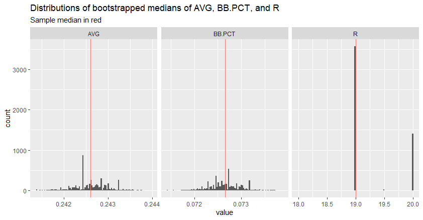

# Bootstrapping exercise in R and Go

## Introduction

This project compares techniques and execution time in bootstrapping a standard error of the median for three selected baseball statistics.

Bootstrapping estimates a statistical parameter from a sample by taking samples of equal size from the original sample, with replacement.  For example, a sample of 1,000 observations will be randomly resampled with 1,000 observations drawn from the original sample.  Because  the sampling is done with replacement, many observations will be represented more than one, and others will not be chosen at all.

From these re-samples, the statistic of interest is calculated.  This is repeated a large number of times, allowing estimation of the variation of the statistic of interest.

## Running the code

Feel free to clone this project and run the scripts on your own machine!

To run the R version, run the file `bootstrap.R` in your preferred method for R scripts.  RStudio was used for the outputs shown here.

To run the Go version there are two options.  Use the terminal to navigate to your local directory and either:
* use the command `go run bootstrap.go` to run the Go file directly, or
* use the command  `bootstrap` to run the Go executable file `bootstrap.exe`

## Project details

Major League Baseball individual players' single-season batting data was downloaded from the [Fangraphs leaderboard page](https://www.fangraphs.com/leaders/major-league?pos=all&stats=bat&lg=all).  All seasons from 1978 to 2024 were used, filtered by players who had at least ten plate appearances in a season.  Batting average, walk percentage, and runs scored were the selected statistics, with 31,262 player seasons returned in all.

R and Go were used to estimate bootstrapped standard errors for the medians of each statistic.

## Bootstrapping with R

R's `boot` package was used; among choices considered it offered ease of use alongside good performance.  If needed, the packages `boot` and `rlist` can be installed by unhiding the second and/or third lines of code in `bootstrap.R`.

A histogram of the data shows that average (AVG) is left-skewed, runs (R) are right-skewed, and walk percentage (BB.) is not heavily skewed in either direction:


Bootstrapped standard errors were estimated using `boot` along with the processing time of the operation.  The data was resampled 5,000 times to get the standard error estimates for the median of each statistic:

```
[1] "Statistic: AVG"
[[1]]

ORDINARY NONPARAMETRIC BOOTSTRAP


Call:
boot(data = baseball[, cols[i]], statistic = med, R = N)


Bootstrap Statistics :
     original       bias     std. error
t1* 0.2426036 7.173114e-06 0.0003826049

[1] "Statistic: BB."
[[1]]

ORDINARY NONPARAMETRIC BOOTSTRAP


Call:
boot(data = baseball[, cols[i]], statistic = med, R = N)


Bootstrap Statistics :
      original       bias     std. error
t1* 0.07265697 6.951163e-06 0.0003210851

[1] "Statistic: R"
[[1]]

ORDINARY NONPARAMETRIC BOOTSTRAP


Call:
boot(data = baseball[, cols[i]], statistic = med, R = N)


Bootstrap Statistics :
    original  bias    std. error
t1*       19    0.28   0.4482635

[1] "Total Run Time:"
Time difference of 29.74731 secs
```

The medians of each bootstrapped sample are shown below.  The red line indicates the original sample medians for each statistic of interest:



For AVG and BB.PCT there could be some skew in each set of bootstrapped medians, though the biases for each are essentially nothing compared to the sample median.  Runs was a binary, unsurprisingly for a discrete variable, with most ending up at 19 and a substantial minority at 20.

## Bootstrapping with Go

The Go program requires the packages `github.com/go-gota/gota/dataframe` and `github.com/Preetam/bootstrap`; to install run the commands `go get github.com/go-gota/gota/dataframe` and `go get github.com/Preetam/bootstrap` from the terminal if running the program from the source code is desired.  _Note: this step is not needed if the program is run from the executable file._


## References

Canty, Angelo, and B. D. Ripley.  boot: Bootstrap R (S-Plus) Functions. R package version 1.3-31.  2024.  https://cran.r-project.org/web/packages/boot/index.html

Fangraphs.  _Major Leage Leaderboards - 1978 to 2024 - Batting_.  Accessed May 22, 2025.  https://www.fangraphs.com/leaders/major-league?pos=all&stats=bat&lg=all&type=c%2C23%2C34%2C12&month=0&ind=1&team=0&rost=0&players=0&startdate=&enddate=&season1=1978&season=2024&sortcol=5&sortdir=default&qual=10&v_cr=202301&pagenum=1

Gerrand, Andrew.  "Error handling and Go," _The Go Blog._  July 12, 2011.  https://go.dev/blog/error-handling-and-go.

Jinka, Preetam.  "Bootstrap for alerting," _Misframe_ (Blog).  May 7, 2017.  https://misfra.me/2017/05/07/bootstrap-for-alerting/

Jinka, Preetam.  bootstrap package.  Go package version 0.0.0.  November 12, 2017.  https://pkg.go.dev/github.com/go-gota/gota@v0.12.0/dataframe

Sánchez Brotons, Alejandro.  dataframe package.  Go package version 0.12.0.  October 10, 2021.  https://pkg.go.dev/github.com/go-gota/gota@v0.12.0/dataframe
